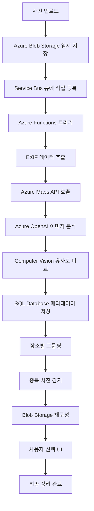

# Travel Photo Organizer
> Azure 기반 여행 사진 자동 정리 서비스


## 🌟 프로젝트 개요

여행 후 수백 장의 사진을 GPS 기반으로 **자동 정리**하고 **중복 사진을 제거**하는 Azure 클라우드 서비스입니다.

### 해결하려는 문제
- 📷 여행 후 수백 장 사진 정리에 많은 시간 소모
- 🔄 같은 장소에서 비슷하게 찍은 중복 사진들
- 📍 어디서 찍었는지 기억나지 않는 사진들
- ✨ SNS용 베스트샷 선별의 어려움

### 목표 결과
**100장 → 35장 (65% 절약)** 으로 사진을 자동 정리하여 저장공간과 시간을 절약합니다.

## 🏗️ 아키텍처

### 3-Tier 구조
```
┌─────────────────┐    ┌─────────────────┐    ┌─────────────────┐
│   Frontend      │    │   Backend       │    │   Data Layer    │
│                 │    │                 │    │                 │
│ Azure Static    │───▶│ Azure App       │───▶│ Azure Blob      │
│ Web Apps        │    │ Service +       │    │ Storage         │
│ (React)         │    │ FastAPI         │    │ Azure SQL DB    │
└─────────────────┘    └─────────────────┘    └─────────────────┘
```

### 핵심 Azure 서비스
- **Azure Static Web Apps**: React 기반 프론트엔드 호스팅
- **Azure App Service**: FastAPI 백엔드 서버 + Docker 컨테이너
- **Azure Functions**: 서버리스 이미지 처리 로직
- **Azure Service Bus**: 비동기 메시지 큐
- **Azure OpenAI Service**: GPT-4 Vision, GPT-4 Turbo, DALL-E 3
- **Azure Computer Vision**: 이미지 분석 및 유사도 비교
- **Azure Blob Storage**: 3단계 스토리지 (uploads/albums/archive)
- **Azure SQL Database**: 사진 메타데이터 관리
- **Azure Maps API**: GPS → 한글 장소명 변환
- **Azure Key Vault**: API 키 보안 관리
- **Azure Monitor**: 성능 모니터링
- **Azure API Management**: API 게이트웨이
- **Azure AD B2C**: 사용자 인증

## 🚀 주요 기능

### 1. 장소별 자동 앨범 생성
- EXIF 데이터에서 GPS 좌표 추출
- Azure Maps API로 실제 장소명 변환
- 장소별 폴더 자동 생성 및 분류

### 2. 중복 사진 감지 및 그룹핑
- 연속 촬영 사진 자동 감지
- 시간 + 파일크기 기반 중복 판별
- 사용자 선택 인터페이스 제공

### 3. AI 기반 이미지 분석
- Azure OpenAI GPT-4 Vision을 통한 이미지 내용 분석
- 사진 제목 및 태그 자동 생성
- 촬영 장소 및 상황 추론

## 🔄 서비스 워크플로우



### 상세 처리 과정

1. **업로드 단계**
   - 사용자가 Azure Static Web Apps에 사진 업로드
   - Azure App Service가 파일 검증 후 Blob Storage `/uploads/` 컨테이너에 저장
   - Azure Service Bus 큐에 처리 작업 메시지 전송

2. **비동기 분석 단계** (Azure Functions)
   - **EXIF 추출**: GPS 좌표, 촬영시간, 카메라 정보
   - **위치 변환**: Azure Maps API로 좌표 → "해운대 해수욕장" 한글 장소명
   - **AI 분석**: Azure OpenAI GPT-4 Vision으로 이미지 내용 분석
   - **유사도 계산**: Azure Computer Vision으로 중복 사진 감지
   - **메타데이터 저장**: Azure SQL Database에 모든 정보 저장

3. **자동 그룹핑 단계**
   - 장소별 앨범 생성: "해운대 45장", "광안대교 32장"
   - 시간 + 유사도 기반 중복 그룹 생성
   - `/albums/장소명/` 컨테이너로 사진 재구성

4. **사용자 선택 단계**
   - React UI에서 중복 그룹별 썸네일 표시
   - 사용자가 원하는 사진만 선택
   - 선택되지 않은 사진은 `/archive/` 이동 (30일 후 자동 삭제)

5. **최종 결과**
   - 입력: 100장 → 출력: 35장 (65% 절약)
   - Azure Monitor로 처리 과정 모니터링

## 🛠️ 기술 스택

### Frontend
- **React**: 사용자 인터페이스
- **Azure Static Web Apps**: 호스팅

### Backend
- **FastAPI**: REST API 서버
- **Python**: 핵심 로직 구현
- **Azure App Service**: 서버 호스팅

### AI/ML
- **Azure OpenAI Service**: GPT-4 Vision, GPT-4 Turbo, DALL-E 3
- **Azure Computer Vision**: 이미지 분석 (OpenCV 대신)

### Database & Storage
- **Azure SQL Database**: 메타데이터 관리
- **Azure Blob Storage**: 이미지 파일 저장

### DevOps
- **Azure DevOps**: CI/CD 파이프라인
- **Docker**: 컨테이너화
- **Azure Container Registry**: 이미지 저장소
- **Azure Bicep**: Infrastructure as Code (Terraform 대신)
- **GitHub**: 소스 코드 관리

### Monitoring
- **Azure Monitor**: 성능 모니터링
- **Application Insights**: 사용자 행동 분석
- **Log Analytics**: 로그 중앙 관리

## 📊 프로젝트 구성 (Azure DevOps)

### Epic 구조
```
📁 Travel Photo Organizer
├── 🎯 Epic 1: 기획 및 설계
│   ├── 📋 Feature 1.1: 구성도 완성
│   └── 📋 Feature 1.2: 요구사항 정의
├── 🎯 Epic 2: AI 기능 개발
│   ├── 📋 Feature 2.1: OpenAI 연동
│   └── 📋 Feature 2.2: 데이터 처리
├── 🎯 Epic 3: 인프라 구축
│   ├── 📋 Feature 3.1: 컨테이너화
│   └── 📋 Feature 3.2: Azure 서비스 배포
└── 🎯 Epic 4: 배포 및 모니터링
    ├── 📋 Feature 4.1: CI/CD 파이프라인
    └── 📋 Feature 4.2: 모니터링 설정
```

## 💰 예상 비용

| 서비스 | 월 예상 비용 | 비고 |
|--------|-------------|------|
| Azure App Service | $13 | 컨테이너 호스팅 |
| Azure SQL Database | $5 | 또는 PostgreSQL 고려 |
| Azure Blob Storage | $2-5 | 3단계 스토리지 |
| Azure Maps API | $1-2 | GPS 변환 |
| Azure OpenAI Service | $3-5 | GPT-4 Vision 사용량 기반 |
| Azure Computer Vision | $1-2 | 유사도 분석 |
| **총 예상 비용** | **$25-32/월** | **AI Search 제외로 비용 절약** |

## 🚀 시작하기

### 필수 요구사항
- Azure 구독
- Python 3.9+
- Docker
- Node.js 16+

### 설치 및 실행

1. **리포지토리 클론**
```bash
git clone https://github.com/[username]/travel-photo-organizer.git
cd travel-photo-organizer
```

2. **환경 변수 설정**
```bash
cp .env.example .env
# Azure 서비스 키 정보 입력
```

3. **로컬 개발 환경 실행**
```bash
# 백엔드
cd backend
pip install -r requirements.txt
uvicorn main:app --reload

# 프론트엔드
cd frontend
npm install
npm start
```

4. **Docker 컨테이너 실행**
```bash
docker-compose up -d
```


## 📄 라이선스

MIT License

## 👨‍💻 개발자

**이채림** 

---

## 🏗️ Infrastructure as Code

### Terraform으로 구축한 Azure 인프라

**배포된 리소스 (총 10개)**

#### Network Infrastructure
- Resource Group: `rg-travelphoto-dev`
- Virtual Network: `vnet-travelphoto` (10.0.0.0/16)
- Public Subnet: 10.0.1.0/24
- Private Subnet: 10.0.2.0/24
- Network Security Group (HTTPS/HTTP 허용)

#### Storage Infrastructure
- Storage Account: `sttravelphotodev`
- Blob Containers: `uploads`, `albums`, `archive`

### 📁 Terraform 코드 구조
```
├── main.tf              # 메인 설정
├── variables.tf         # 변수 정의
├── outputs.tf           # 출력값
├── backend.tf           # State 원격 저장
└── modules/
    ├── network/         # Network 모듈
    └── storage/         # Storage 모듈
```

### 🚀 배포 방법
```bash
# 초기화
terraform init

# 계획 확인
terraform plan

# 배포
terraform apply
```


